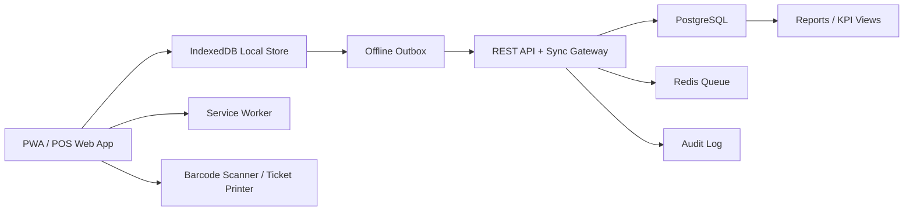

# System Architecture

## Objectives

Build a secure offline-first PWA for hardware store operations with retail POS,
barcode workflows, inventory traceability, manufacturing orders, purchasing,
finance, HR, and reporting. The system must remain usable during internet
outages and synchronize reliably when connectivity returns.

## Recommended Technical Stack

| Layer | Technology | Purpose |
| --- | --- | --- |
| Frontend | React + TypeScript + Vite or Next.js | Responsive web application and POS UI |
| PWA | Service Worker + Web App Manifest | Installable app, asset caching, offline shell |
| Local data | IndexedDB via Dexie.js | Offline stock, POS, customer, and sync outbox |
| Backend API | Node.js + NestJS/Fastify + TypeScript | REST API, sync gateway, RBAC, integrations |
| Database | PostgreSQL 16 | Canonical cloud/server database |
| ORM | Prisma or Drizzle | Schema migrations and typed database access |
| Cache/queues | Redis + BullMQ | Deferred sync jobs, receipt printing jobs, analytics |
| Auth | JWT access tokens + refresh tokens | Secure role-based access |
| Reporting | SQL views + materialized aggregates | KPI dashboards and exports |
| Deployment | VPS Docker Compose, or frontend on Vercel/Netlify + API on VPS | SME-friendly deployment |
| Observability | OpenTelemetry + structured logs | Audit, sync debugging, operational visibility |

## Component Model

## Offline-First Design

The PWA stores operational data locally in IndexedDB: products, locations,
stock balances, customers, user profile, active shifts, price lists, pending
sales, production orders, and the sync outbox. Writes are first recorded locally
as immutable operations, then sent to the server through `/sync/push`.

Core local tables:

- `local_entities`: cached server records by entity type and id.
- `local_outbox`: pending operations with idempotency keys.
- `local_sync_state`: last successful pull cursor per store/location.
- `local_conflicts`: records requiring supervisor resolution.

The UI must never block normal cashier flow because the network is down. POS
sales, stock movements, and production consumption are accepted offline if the
user has a valid cached session and the local data is not expired beyond policy.

## Synchronization Model

Each mutation is stored as an operation:

- `operation_id`: UUID generated by the device.
- `entity_type`: e.g. `sale`, `stock_movement`, `production_order`.
- `entity_id`: UUID of the affected entity.
- `location_id`: store/warehouse context.
- `device_id`: POS or workstation id.
- `base_version`: entity version known when the change was made.
- `payload`: JSON patch or domain command.
- `occurred_at`: device timestamp.
- `idempotency_key`: stable key for safe retries.

The server applies operations transactionally, increments `version`, writes
domain audit logs, and returns accepted operations plus conflicts.

## Conflict Resolution

| Domain | Resolution |
| --- | --- |
| Sales | Idempotent by receipt number and device id. Duplicate pushes return existing sale. |
| Stock | Append-only stock ledger; never overwrite balances. Conflicts become adjustment tasks. |
| Product master data | Server wins by default; admin can merge field-level changes. |
| Prices | Latest approved price list by effective date wins. |
| Manufacturing | Production state transitions are validated by version. Conflicting transitions require production manager approval. |
| Customer balances | Ledger-based calculation; payments and invoices are immutable once posted. |

Inventory uses an append-only movement ledger so concurrent sales from multiple
locations do not corrupt stock. If offline sales create negative theoretical
stock, the system flags the product for reconciliation instead of deleting the
sale.

## Security Architecture

- Passwords hashed with Argon2id.
- JWT access tokens expire quickly; refresh tokens are rotating and revocable.
- Cached offline sessions are encrypted at rest where browser support permits.
- RBAC permissions are enforced in both UI and API.
- All sensitive actions create audit log entries.
- Server validates every operation, including those created offline.
- Device registration is required before offline operation.

## Roles and Permissions

| Role | Main Permissions |
| --- | --- |
| Admin | Full configuration, users, locations, products, prices, reports |
| Stock Manager | Stock counts, transfers, adjustments, supplier receiving |
| Production Manager | Bills of materials, production orders, consumption, completion |
| Cashier | POS sales, returns, customer lookup, shift close |
| Accountant | Payments, expenses, OHADA reports, financial exports |
| HR Manager | Employees, time tracking, productivity reports |

## Multi-Location Support

The platform supports stores, warehouses, production workshops, and POS
terminals as separate locations/devices. Stock is tracked by `location_id`.
Transfers are two-step movements: dispatch from source and receipt at
destination. Offline transfers are allowed only from the initiating device and
must be confirmed by the receiving location.

## Hardware Integrations

- Barcode scanners: USB HID keyboard mode by default; optional Web Serial/WebUSB
  for advanced devices.
- Ticket printers: browser print for simple setups; QZ Tray or local print
  bridge for ESC/POS thermal printers.
- Cash drawers: triggered through ESC/POS printer pulse command where supported.
- Label printers: product and shelf labels through PDF/HTML templates.

## Accounting and OHADA Alignment

The system separates operational documents from posted accounting entries.
Sales, purchases, payments, expenses, stock valuation, and payroll exports feed
an accounting ledger that can be mapped to OHADA account numbers. Fiscal
periods, document numbering, immutable posted entries, and audit trails are
mandatory.

